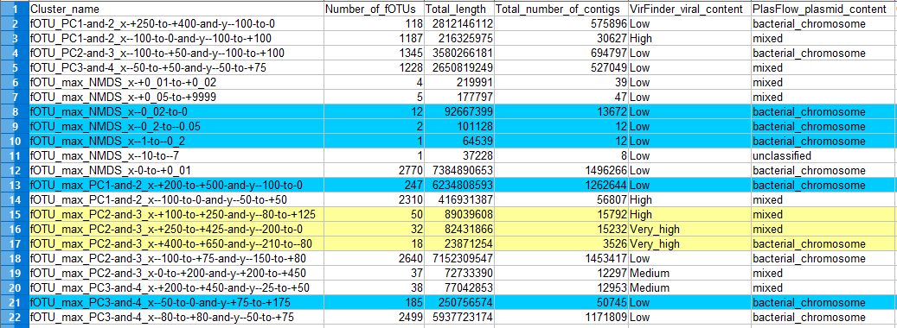

\clearpage

# Introduction

In this document will be studied further what features are present in mainly two groups:

1. VirFinder viral content is low and PlasFlow result suggests bacterial chromosomal material (putatively predominantly bacterial chromosomal content) (blue rows in Figure 1)

2. VirFinder viral content is high or very high and PlasFlow result suggests bacterial chromosomal material or mixed (putatively predominantly viral content) (yellow rows in Figure 1)

These estimation as based on previewing `summary_statistics.csv` file.




\clearpage

# Gathering non-dublicate lists

First task is to gather lists of fOTUs of both of the above mentioned groups. 

```{bash eval=FALSE, include=TRUE}
LIST_DIR="../analyses/HMMsearch/lists_of_clusters/"
COMM="../../../scripts/find_common.pl"
UNIQ="../../../scripts/uniquefy.pl"

# Array for holding predominantly chrom bacterial clusters (putative)
declare -a BACT
BACT[0]="fOTU_max_NMDS_x--0_02-to-0.txt"
BACT[1]="fOTU_max_NMDS_x--0_2-to--0_05.txt"
BACT[2]="fOTU_max_NMDS_x--1-to--0_2.txt"
BACT[3]="fOTU_max_PC1-and-2_x-+200-to-+500-and-y--100-to-0.txt"
BACT[4]="fOTU_max_PC3-and-4_x--50-to-0-and-y-+75-to-+175.txt"
# Array for holding predominantly viral clusters (putative)
declare -a VIR
VIR[0]="fOTU_max_PC2-and-3_x-+100-to-+250-and-y--80-to-+125.txt"
VIR[1]="fOTU_max_PC2-and-3_x-+250-to-+425-and-y--200-to-0.txt"
VIR[2]="fOTU_max_PC2-and-3_x-+400-to-+650-and-y--210-to--80.txt"

cd "$LIST_DIR"
# Let's now find a common non-dublicated list for both the viral and bacterial fOTUs
perl "$UNIQ" ${BACT[0]} ${BACT[1]} ${BACT[2]} ${BACT[3]} ${BACT[4]} > "b_fOTUs.txt"
perl "$UNIQ" ${VIR[0]} ${VIR[1]} ${VIR[2]} > "v_fOTUs.txt"

echo "The fOTUs in common between the two identified clusters:"

perl "$COMM" "b_fOTUs.txt" "v_fOTUs.txt" "bact_fOTUs.txt" "vir_fOTUs.txt"

BACT_NUM=$(echo $(wc -l "bact_fOTUs.txt")| awk '{print $1}')
VIR_NUM=$(echo $(wc -l "vir_fOTUs.txt") | awk '{print $1}')

echo -e "\nThere are $BACT_NUM fOTUs in the putatively bacterial cluster."
echo "There are $VIR_NUM fOTUs in the putatively viral cluster."

# Remove temporary files
rm "b_fOTUs.txt" "v_fOTUs.txt"
```

# Gather grouped text files

From the fOTU wise data files it might be interesting to see if there are any patterns in these two groups (putatively more viral or bacterial). These pieces of information are now gathered into files one for each group:

- COGs functional category
- Description of the COG (in eggNOG database)
- Taxonomic order
- Taxonomic family
- Taxonomic species
- Scientific name

## Create directories with soft links of the two groups

It will be maybe somewhat more easier to handle all the fOTUs of same type when they are in own directories (as symbolic links). Then one could just use globbing to access all the fOTUs with one expression. Let's use AWK to create the directories with relevant links inside them.

```{bash eval=FALSE, include=TRUE}
BACT_LIST="../../lists_of_clusters/bact_fOTUs.txt"
VIR_LIST="../../lists_of_clusters/vir_fOTUs.txt"
OUT_DIR_BACT="../analyses/HMMsearch/validation_and_further_analyses/bacts_lns/"
OUT_DIR_VIR="../virs_lns/"
SCRIPT="../../../../scripts/groupSymLinkify.awk"
cd $OUT_DIR_BACT
awk -f "$SCRIPT" "$BACT_LIST"
cd "$OUT_DIR_VIR"
awk -f "$SCRIPT" "$VIR_LIST"
```

In the AWK scripts above the current working directories are the same as the shell that started the script.

## Gather grouped data files

```{bash eval=FALSE, include=TRUE}
OUT_DIR_BACT="../analyses/HMMsearch/validation_and_further_analyses/bacts_lns/"
OUT_DIR_VIR="../analyses/HMMsearch/validation_and_further_analyses/virs_lns/"
OUT="../analyses/HMMsearch/validation_and_further_analyses/cluster_data/"
SCRIPT_COGcat="../scripts/groupCOGcat.awk"
SCRIPT_Names="../scripts/groupNames.awk"
SCRIPT_Descs="../scripts/groupDescs.awk"
SCRIPT_Taxons="../scripts/groupTaxons.awk"

awk -F"\t" -f "$SCRIPT_COGcat" "$OUT_DIR_BACT"*".tsv" >> "$OUT""bact_COGcats.txt"

awk -F"\t" -v header="sci_names" -v field="8" \
-f "$SCRIPT_Names" "$OUT_DIR_BACT"*".tsv" >> "$OUT""bact_Sci_Names.txt"
awk -F"\t" -v header="species" -v field="14" \
-f "$SCRIPT_Names" "$OUT_DIR_BACT"*".tsv" >> "$OUT""bact_Spec_Names.txt"

awk -F"\t" -f "$SCRIPT_Descs" "$OUT_DIR_BACT"*".tsv" >> "$OUT""bact_Descs.txt"

awk -F"\t" -v header="orders" -v field="10" \
-f "$SCRIPT_Taxons" "$OUT_DIR_BACT"*".tsv" >> "$OUT""bact_Orders.txt"
awk -F"\t" -v header="families" -v field="11" \
-f "$SCRIPT_Taxons" "$OUT_DIR_BACT"*".tsv" >> "$OUT""bact_Families.txt"


awk -F"\t" -f "$SCRIPT_COGcat" "$OUT_DIR_VIR"*".tsv" >> "$OUT""vir_COGcats.txt"

awk -F"\t" -v header="sci_names" -v field="8" \
-f "$SCRIPT_Names" "$OUT_DIR_VIR"*".tsv" >> "$OUT""vir_Sci_Names.txt"
awk -F"\t" -v header="species" -v field="14" \
-f "$SCRIPT_Names" "$OUT_DIR_VIR"*".tsv" >> "$OUT""vir_Spec_Names.txt"

awk -F"\t" -f "$SCRIPT_Descs" "$OUT_DIR_VIR"*".tsv" >> "$OUT""vir_Descs.txt"

awk -F"\t" -v header="orders" -v field="10" \
-f "$SCRIPT_Taxons" "$OUT_DIR_VIR"*".tsv" >> "$OUT""vir_Orders.txt"
awk -F"\t" -v header="families" -v field="11" \
-f "$SCRIPT_Taxons" "$OUT_DIR_VIR"*".tsv" >> "$OUT""vir_Families.txt"
```


# Check what is in the clusters

Now that we have these twelve text files. Let's read them in a form wordclouds from them.

```{r eval=FALSE, include=TRUE}
#install.packages("wordcloud")
#install.packages("RColorBrewer")
#install.packages("tm")
library(wordcloud)
library(RColorBrewer)
library(tm)
library(tidyverse)
```

Let's define some functions. These functions will do the hard work of producing the visualisations.

```{r eval=FALSE, include=TRUE}
de_underscore <- function(underscored) {
  de_underscored <- gsub("_",
                         " ",
                         underscored)
  de_underscored
  }

wordCloudify <- function(input_filename, output_filename){
  raw_text <- readLines(input_filename,
                        warn = F)
  docs <- Corpus(VectorSource(raw_text))
  # build a term-document matrix:
  tdm <- TermDocumentMatrix(docs)
  mat <- as.matrix(tdm)
  named_num <- sort(rowSums(mat),decreasing=TRUE)
  freq_data <- tibble(entity = names(named_num), 
                      freq=named_num) %>% 
    mutate_at(vars(entity), 
              funs(de_underscore))
  
  #head(d, 10)
  
  # generate the wordcloud:
  png(filename = output_filename)
  wordcloud(words = freq_data$entity,
            freq = freq_data$freq,
            min.freq = 1,
            max.words=200,
            random.order=FALSE, 
            rot.per=0.35, 
            colors=brewer.pal(8, "Dark2"))
  dev.off()
}
```

The input files are stored next.

```{r eval=FALSE, include=TRUE}
dir_path <- "../analyses/HMMsearch/validation_and_further_analyses/cluster_data/"
files <- list.files(path = dir_path,
                    pattern = ".+.txt")
```

Lastly, let's create word clouds to visualise which entities are most common with respect to the aforementioned aspects.

```{r eval=FALSE, include=TRUE}
output_dir <- "../visualisations/HMMsearch/wordClouds/"
for (text_file in files) {
  in_file_name <- paste(dir_path,
                        text_file,
                        sep = "")
  extensionless <- gsub(".txt","",text_file)
  out_file_name <- paste(output_dir,
                         extensionless,
                         ".png",
                         sep = "")
  wordCloudify(in_file_name, out_file_name)
}
```

