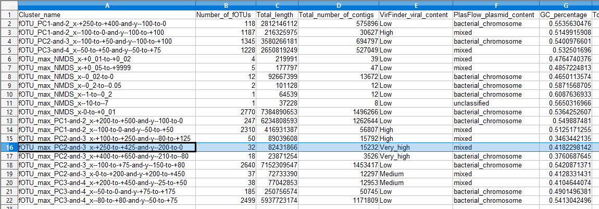

\clearpage

# Introduction

In this document will be studied further what features are present in manually clustered fOTU group `fOTU_max_PC2-and-3_x-+250-to-+425-and-y--200-to-0` (row 16 in Figure 1). Further, e-value filtering (of $10^{-2}$) and *Function unknown* of COG categories are filtered from these following clusters:

1. VirFinder viral content is low and PlasFlow result suggests bacterial chromosomal material (putatively predominantly bacterial chromosomal content).

2. VirFinder viral content is high or very high and PlasFlow result suggests bacterial chromosomal material or mixed (putatively predominantly viral content)

These estimation as based on previewing `summary_statistics.csv` file. The filtering of *Function unknown* of COG categories will help to see differences better between what is already there when it comes to viral material. 4




\clearpage

# Features of interest that will be studied further

From the fOTU wise data files it might be interesting to see what is included in the matches with HMMs. These features are checked further in this document:

- COGs functional category
- Description of the COG (in eggNOG database)
- Taxonomic order
- Taxonomic family
- Taxonomic species
- Scientific name

## Gather grouped data files

In this section new filtered (with respect to e-value and *Function unknown* in COG categories) data files are produced. In addition, `fOTU_max_PC2-and-3_x-+250-to-+425-and-y--200-to-0` cluster will be studied separately. In order that the filtering will be implemented some adjustments to the AWK scripts used, need to be made. 

```{bash eval=FALSE, include=TRUE}
OUT_DIR_BACT="../analyses/HMMsearch/validation_and_further_analyses/bacts_lns/"
OUT_DIR_VIR="../analyses/HMMsearch/validation_and_further_analyses/virs_lns/"
OUT="../analyses/HMMsearch/validation_and_further_analyses/cluster_data/"
SCRIPT_COGcat="../scripts/groupCOGcat.awk"
SCRIPT_Names="../scripts/groupNames.awk"
SCRIPT_Descs="../scripts/groupDescs.awk"
SCRIPT_Taxons="../scripts/groupTaxons.awk"
EVALUE="2.0"

awk -F"\t" -v e_val=$EVALUE -f "$SCRIPT_COGcat" "$OUT_DIR_BACT"*".tsv" \
>> "$OUT""bact_COGcats_filtered.txt"

awk -F"\t" -v e_val=$EVALUE -v header="sci_names" -v field="8" \
-f "$SCRIPT_Names" "$OUT_DIR_BACT"*".tsv" \
>> "$OUT""bact_Sci_Names_filtered.txt"
awk -F"\t" -v e_val=$EVALUE -v header="species" -v field="14" \
-f "$SCRIPT_Names" "$OUT_DIR_BACT"*".tsv" \
>> "$OUT""bact_Spec_Names_filtered.txt"

awk -F"\t" -v e_val=$EVALUE -f "$SCRIPT_Descs" "$OUT_DIR_BACT"*".tsv" \
>> "$OUT""bact_Descs_filtered.txt"

awk -F"\t" -v e_val=$EVALUE -v header="orders" -v field="10" \
-f "$SCRIPT_Taxons" "$OUT_DIR_BACT"*".tsv" \
>> "$OUT""bact_Orders_filtered.txt"
awk -F"\t" -v e_val=$EVALUE -v header="families" -v field="11" \
-f "$SCRIPT_Taxons" "$OUT_DIR_BACT"*".tsv" \
>> "$OUT""bact_Families_filtered.txt"


awk -F"\t" -v e_val=$EVALUE -f "$SCRIPT_COGcat" "$OUT_DIR_VIR"*".tsv" \
>> "$OUT""vir_COGcats_filtered.txt"

awk -F"\t" -v e_val=$EVALUE -v header="sci_names" -v field="8" \
-f "$SCRIPT_Names" "$OUT_DIR_VIR"*".tsv" \
>> "$OUT""vir_Sci_Names_filtered.txt"
awk -F"\t" -v e_val=$EVALUE -v header="species" -v field="14" \
-f "$SCRIPT_Names" "$OUT_DIR_VIR"*".tsv" \
>> "$OUT""vir_Spec_Names_filtered.txt"

awk -F"\t" -v e_val=$EVALUE -f "$SCRIPT_Descs" "$OUT_DIR_VIR"*".tsv" \
>> "$OUT""vir_Descs_filtered.txt"

awk -F"\t" -v e_val=$EVALUE -v header="orders" -v field="10" \
-f "$SCRIPT_Taxons" "$OUT_DIR_VIR"*".tsv" \
>> "$OUT""vir_Orders_filtered.txt"
awk -F"\t" -v e_val=$EVALUE -v header="families" -v field="11" \
-f "$SCRIPT_Taxons" "$OUT_DIR_VIR"*".tsv" \
>> "$OUT""vir_Families_filtered.txt"
```

Lastly let's run the previous groupings on `fOTU_max_PC2-and-3_x-+250-to-+425-and-y--200-to-0` cluster but before that can be done let's create a directory with symbolic links to the relevant fOTUs. 

```{bash eval=FALSE, include=TRUE}
VIR_LIST="../../lists_of_clusters/fOTU_max_PC2-and-3_x-+250-to-+425-and-y--200-to-0.txt"
OUT_DIR_ROOT_VIR="../analyses/HMMsearch/validation_and_further_analyses/"
OUT_DIR_VIR="fOTU_max_PC2-and-3_x-+250-to-+425-and-y--200-to-0_lns/"
SCRIPT="../../../../scripts/groupSymLinkify.awk"
cd "$OUT_DIR_ROOT_VIR""$OUT_DIR_VIR"
awk -f "$SCRIPT" "$VIR_LIST"
```

And now the text files are created...

```{bash eval=FALSE, include=TRUE}
OUT_ROOT_DIR_VIR="../analyses/HMMsearch/validation_and_further_analyses/"
DIR="fOTU_max_PC2-and-3_x-+250-to-+425-and-y--200-to-0_lns/"
OUT="../analyses/HMMsearch/validation_and_further_analyses/cluster_data/"
SCRIPT_COGcat="../scripts/groupCOGcat.awk"
SCRIPT_Names="../scripts/groupNames.awk"
SCRIPT_Descs="../scripts/groupDescs.awk"
SCRIPT_Taxons="../scripts/groupTaxons.awk"
EVALUE="2.0"

awk -F"\t" -v e_val=$EVALUE -f "$SCRIPT_COGcat" "$OUT_ROOT_DIR_VIR""$DIR"*".tsv" \
>> "$OUT""fOTU_max_PC2-and-3_x-+250-to-+425-and-y--200-to-0_vir_COGcats_filtered.txt"

awk -F"\t" -v e_val=$EVALUE -v header="sci_names" -v field="8" \
-f "$SCRIPT_Names" "$OUT_ROOT_DIR_VIR""$DIR"*".tsv" \
>> "$OUT""fOTU_max_PC2-and-3_x-+250-to-+425-and-y--200-to-0_vir_Sci_Names_filtered.txt"
awk -F"\t" -v e_val=$EVALUE -v header="species" -v field="14" \
-f "$SCRIPT_Names" "$OUT_ROOT_DIR_VIR""$DIR"*".tsv" \
>> "$OUT""fOTU_max_PC2-and-3_x-+250-to-+425-and-y--200-to-0_vir_Spec_Names_filtered.txt"

awk -F"\t" -v e_val=$EVALUE -f "$SCRIPT_Descs" "$OUT_ROOT_DIR_VIR""$DIR"*".tsv" \
>> "$OUT""fOTU_max_PC2-and-3_x-+250-to-+425-and-y--200-to-0_vir_Descs_filtered.txt"

awk -F"\t" -v e_val=$EVALUE -v header="orders" -v field="10" \
-f "$SCRIPT_Taxons" "$OUT_ROOT_DIR_VIR""$DIR"*".tsv" \
>> "$OUT""fOTU_max_PC2-and-3_x-+250-to-+425-and-y--200-to-0_vir_Orders_filtered.txt"
awk -F"\t" -v e_val=$EVALUE -v header="families" -v field="11" \
-f "$SCRIPT_Taxons" "$OUT_ROOT_DIR_VIR""$DIR"*".tsv" \
>> "$OUT""fOTU_max_PC2-and-3_x-+250-to-+425-and-y--200-to-0_vir_Families_filtered.txt"
```


# Check what is in the clusters

Now that we have these twelve text files. Let's read them in a form wordclouds from them.

```{r eval=FALSE, include=TRUE}
#install.packages("wordcloud")
#install.packages("RColorBrewer")
#install.packages("tm")
library(wordcloud)
library(RColorBrewer)
library(tm)
library(tidyverse)
```

Let's define some functions. These functions will do the hard work of producing the visualisations.

```{r eval=FALSE, include=TRUE}
de_underscore <- function(underscored) {
  de_underscored <- gsub("_",
                         " ",
                         underscored)
  de_underscored
  }

wordCloudify <- function(input_filename, output_filename){
  raw_text <- readLines(input_filename,
                        warn = F)
  docs <- Corpus(VectorSource(raw_text))
  # build a term-document matrix:
  tdm <- TermDocumentMatrix(docs)
  mat <- as.matrix(tdm)
  named_num <- sort(rowSums(mat),decreasing=TRUE)
  freq_data <- tibble(entity = names(named_num), 
                      freq=named_num) %>% 
    mutate_at(vars(entity), 
              funs(de_underscore))
  
  #head(d, 10)
  
  # generate the wordcloud:
  png(filename = output_filename, 
      width = 1000, 
      height = 1000,)
  wordcloud(words = freq_data$entity,
            freq = freq_data$freq,
            min.freq = 1,
            max.words=200,
            random.order=FALSE, 
            rot.per=0.35, 
            colors=brewer.pal(8, "Dark2"))
  dev.off()
}
```

The input files are stored next.

```{r eval=FALSE, include=TRUE}
dir_path <- "../analyses/HMMsearch/validation_and_further_analyses/cluster_data/"
files <- list.files(path = dir_path,
                    pattern = ".+_filtered.txt")
```

Lastly, let's create word clouds to visualise which entities are most common with respect to the aforementioned aspects.

```{r eval=FALSE, include=TRUE}
set.seed(1234)
output_dir <- "../visualisations/HMMsearch/wordClouds/"
for (text_file in files) {
  in_file_name <- paste(dir_path,
                        text_file,
                        sep = "")
  extensionless <- gsub(".txt","",text_file)
  out_file_name <- paste(output_dir,
                         extensionless,
                         ".png",
                         sep = "")
  wordCloudify(in_file_name, out_file_name)
}
```

